<!-- Animated Header with Particles -->
<div align="center">
  
</div>

<!-- Matrix Effect Typing Animation -->
<p align="center">
  
</p>

<!-- Animated Divider -->


## 🧬 **Digital DNA - Who Am I?**

<table>
<tr>
<td width="50%">

### 🚀 **Quantum Leap Entrepreneur**
```typescript
const ilyasProfile = {
  role: "AgTech Unicorn Founder",
  company: "AquaFlow Quantum",
  mission: "Revolutionizing Agriculture with Quantum AI",
  location: "Morocco 🇲🇦 → Global 🌍",
  stage: "Building $1B+ AgTech Platform",
  impact: "10M+ farmers, 1B+ liters water saved"
};
```

### 🎯 **Current Mission**
- 🌱 **Building AquaFlow Quantum** - The world's most advanced AgTech platform
- 🧠 **Quantum AI Integration** - Pioneering quantum-enhanced crop optimization  
- 💎 **Targeting Unicorn Status** - $1B valuation within 24 months
- 🏛️ **Government Partnerships** - $850M potential acquisition target
- 🌍 **Global Expansion** - Morocco → MENA → Worldwide

</td>
<td width="50%">

### 🔬 **Tech Arsenal**
<p align="center">
  
</p>

### 💡 **Innovation Stats**
- 🏆 **9+ Patent Applications** Filed
- 📊 **99.3% AI Accuracy** Achieved
- 💰 **$149K Net Profit** Year 1 Projection
- 🌊 **25% Water Savings** Guaranteed
- 📈 **150% YoY Growth** Target

</td>
</tr>
</table>

<!-- Animated Divider -->


## ⚡ **Quantum-Enhanced Tech Stack**

<details>
<summary>🧠 <b>AI & Machine Learning Arsenal</b></summary>
<br>

| Technology | Level | Application |
|------------|-------|-------------|
|  | Expert | Crop optimization algorithms |
|  | Advanced | Deep learning models |
|  | Advanced | Neural networks |
|  | Expert | GPT integration |

</details>

<details>
<summary>🔗 <b>Blockchain & Web3</b></summary>
<br>

| Technology | Level | Application |
|------------|-------|-------------|
|  | Advanced | Smart contracts |
|  | Intermediate | Agricultural data integrity |
|  | Advanced | Decentralized agriculture |

</details>

<details>
<summary>🌐 <b>Cloud & DevOps Mastery</b></summary>
<br>

<p align="center">
  
</p>

</details>

<details>
<summary>📱 <b>Full-Stack Development</b></summary>
<br>

**Frontend Wizardry:**
<p align="left">
  
</p>

**Backend Mastery:**
<p align="left">  
  
</p>

**Database Excellence:**
<p align="left">
  
</p>

</details>

<!-- Animated Divider -->


## 🚀 **Revolutionary Projects Portfolio**

<div align="center">
  
### 🌌 **AquaFlow Quantum** - The Unicorn Project

```mermaid
graph TB
    A[🧠 Quantum AI Core] --> B[🌱 Smart Agriculture]
    A --> C[💧 Water Optimization] 
    A --> D[📊 Yield Prediction]
    B --> E[🚜 IoT Sensors Network]
    C --> F[💰 Financial Integration]
    D --> G[🌍 Global Scaling]
    E --> H[📈 $1B+ Valuation]
    F --> H
    G --> H
```


</div>



**🎯 Key Innovations:**
- **Quantum-Enhanced AI**: 99.3% crop prediction accuracy
- **Proprietary IoT Sensors**: DNA-level soil analysis
- **Blockchain Data Integrity**: Immutable agricultural records  
- **Economic Optimization**: Automated commodity trading
- **Government Integration**: $850M acquisition potential

---

### 🛒 **Next-Gen E-Commerce Ecosystem**


**Tech Stack:**
```yaml
Frontend: React + TypeScript + Tailwind
Backend: Spring Boot Microservices
Database: MongoDB + Redis Caching
Cloud: AWS + Docker + Kubernetes
AI: Recommendation Engine + ML Analytics
```

---

### 🤖 **Quantum AI Chatbot Platform**  


</div>

<!-- Animated Divider -->


## 📊 **Performance Matrix & Battle Stats**

<div align="center">

### 🔥 **GitHub Dominance Dashboard**

<table>
<tr>
<td align="center">

</td>
<td align="center">

</td>
</tr>
</table>

### ⚡ **Coding Streak & Activity**


### 🏆 **Achievement Unlocked**


### 📈 **Contribution Heatmap**


</div>

<!-- Animated Divider -->


## 🎯 **Current Mission Objectives**

<div align="center">

### 🚀 **2025 Roadmap to Unicorn Status**


### 💎 **Success Metrics Dashboard**

| Metric | Current | Target 2025 | Status |
|--------|---------|-------------|---------|
| **Valuation** | Seed Stage | $1B+ | 🚀 Building |
| **Revenue** | $0 | $50M+ | 📈 Growing |
| **Farmers** | 0 | 50,000+ | 🌱 Scaling |
| **Patents** | 9 Filed | 20+ Granted | ⚡ Processing |
| **Countries** | 1 | 10+ | 🌍 Expanding |

</div>

<!-- Animated Divider -->


## 🌟 **Connect With the Future**

<div align="center">

### 💫 **Digital Presence Network**

<table>
<tr>
<td align="center" width="200">
<a href="https://www.linkedin.com/in/ilyasouerdii">

<br><sub><b>Professional Network</b></sub>
</a>
</td>
<td align="center" width="200">
<a href="mailto:ilyasouerdii@gmail.com">

<br><sub><b>Direct Contact</b></sub>
</a>
</td>
<td align="center" width="200">
<a href="https://github.com/ilyasouerdii">

<br><sub><b>Code Repository</b></sub>
</a>
</td>
<td align="center" width="200">
<a href="https://twitter.com/ilyasouerdii">

<br><sub><b>Tech Insights</b></sub>
</a>
</td>
</tr>
</table>

### 🤝 **Collaboration Opportunities**


### 💌 **Let's Build the Future Together**

```typescript
interface Collaboration {
  partnerships: "AgTech | AI | Quantum Computing";
  investments: "Seed to Series A rounds";
  consulting: "Enterprise AI & IoT solutions";
  speaking: "Tech conferences & universities";
  mentorship: "Aspiring entrepreneurs";
}

// Ready to change the world? Let's connect! 🚀
```

</div>

<!-- Animated Divider -->


## 🎮 **Easter Eggs & Fun Zone**

<div align="center">

### 🏅 **Profile Power Level**


### 🎯 **Random Dev Fact**


### 🐍 **GitHub Contribution Snake**

<picture>
  <source media="(prefers-color-scheme: dark)" srcset="https://raw.githubusercontent.com/ilyasouerdii/ilyasouerdii/output/github-contribution-grid-snake-dark.svg">
  <source media="(prefers-color-scheme: light)" srcset="https://raw.githubusercontent.com/ilyasouerdii/ilyasouerdii/output/github-contribution-grid-snake.svg">
  
</picture>

### 🎵 **Currently Coding To**


</div>

<!-- Animated Footer -->
<div align="center">
  
</div>

---

<div align="center">
  
### 💎 **"Code is poetry, AI is magic, and entrepreneurship is the art of making the impossible inevitable."**


</div>
